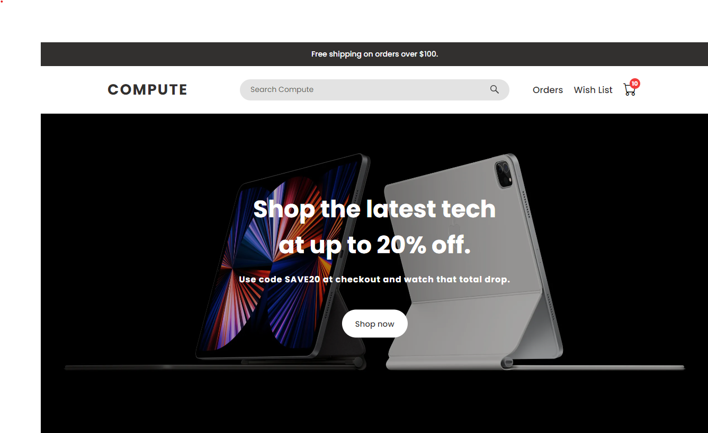
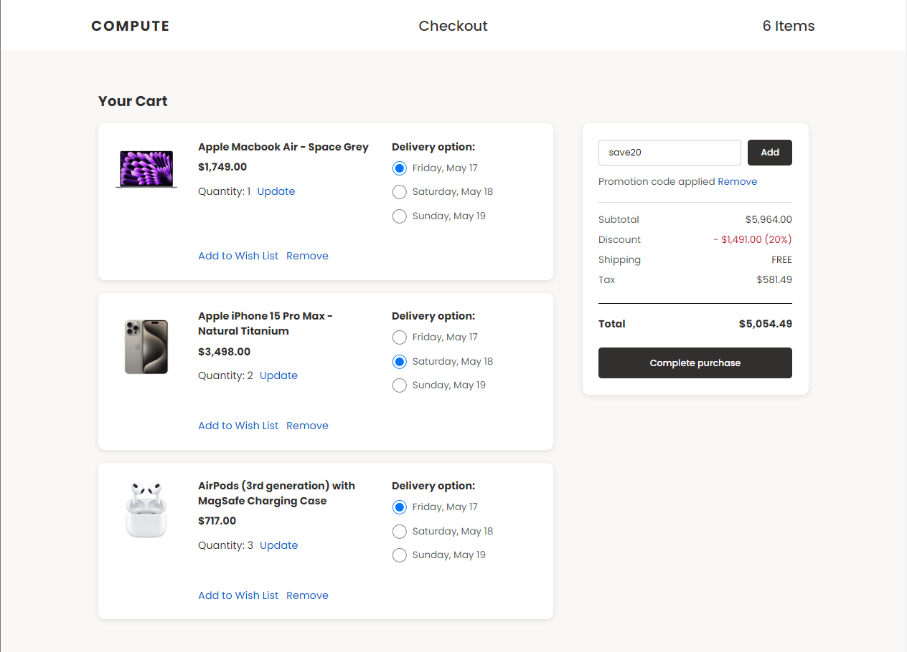
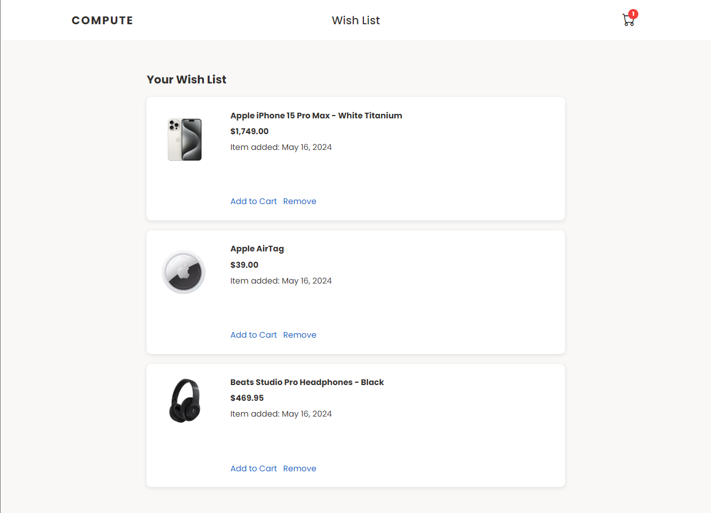
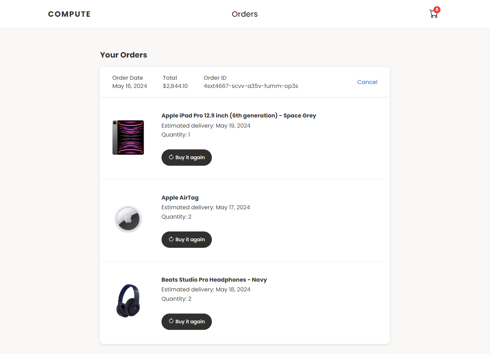

# Compute Store (E-commerce Store)

## Overview
The Compute Store offers an immersive shopping experience for the latest tech products. The application provides seamless product searching, browsing, wish list management, and cart features, allowing you to find and organize your desired products easily. It also offers a discount application feature for cost-saving opportunities, secure order placement, and order tracking through order history viewing.

### Preview

Explore the Compute Store at [computestore.ca](computestore.ca).

### Additional Information
- **Homepage**: Easily add products to your wish list and cart. Customize the number of items in your cart and use the search bar for quick product navigation.
- **Wish List Page**: View wish list items and the date they were added for transparency.
- **Checkout Page**: View cart items, wish list items, and an order summary. Customize delivery dates and apply discounts for savings. Enjoy free shipping for qualifying orders.
- **Orders Page**: View detailed order information, including order date, total, and ID. Cancel orders with assurance through a confirmation popup.
- **Product Popup View**: Click on product images to enlarge them for better viewing.
- **Responsiveness**: Enjoy a seamless experience across various devices with responsive design.

## Technologies Used
- HTML, CSS, JavaScript, Git, GitHub Pages

## Developer
**Reshawn Lofters** - [LinkedIn](https://www.linkedin.com/in/reshawnlofters/)