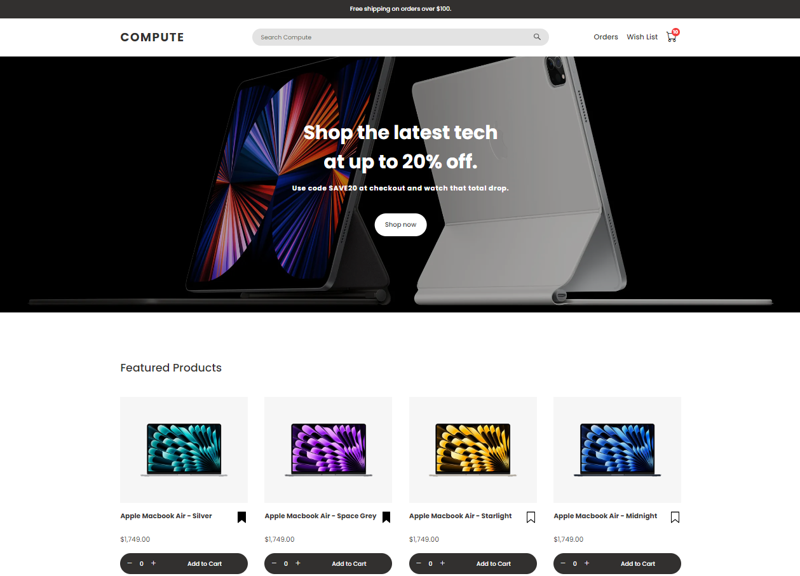

# Compute Store: E-commerce Store Simulator

## Overview
The Compute Store is an e-commerce store simulator for tech products. Key features include product search, wish list and cart management, discount handling, order processing, and order history.

Explore the Compute Store at [computestore.ca](https://computestore.ca).

### Preview

## Usage
- **Homepage**: Browse products, add items to your wish list or cart, and use the search bar for quick filtering.
- **Wish List Page**: View, manage, and move items from your wish list to your cart.
- **Checkout Page**: Review cart and wish list items, customize delivery dates, apply discounts, and qualify for free shipping on eligible orders.
- **Orders Page**: View detailed order history and manage existing orders, including cancellations.
- **Product Popup View**: Click any product image to enlarge it for detailed viewing.
- **Responsiveness**: The interface is fully responsive across desktop and mobile devices.

## Technologies Used
JavaScript, HTML/CSS, Microsoft Azure, Git

## Author
Developed and maintained by Reshawn Lofters. For inquiries or feedback: [reshawnalofters@gmail.com](mailto:reshawnalofters@gmail.com).

## License
This project is licensed under a custom license. See the [LICENSE](./LICENSE) file for details.
