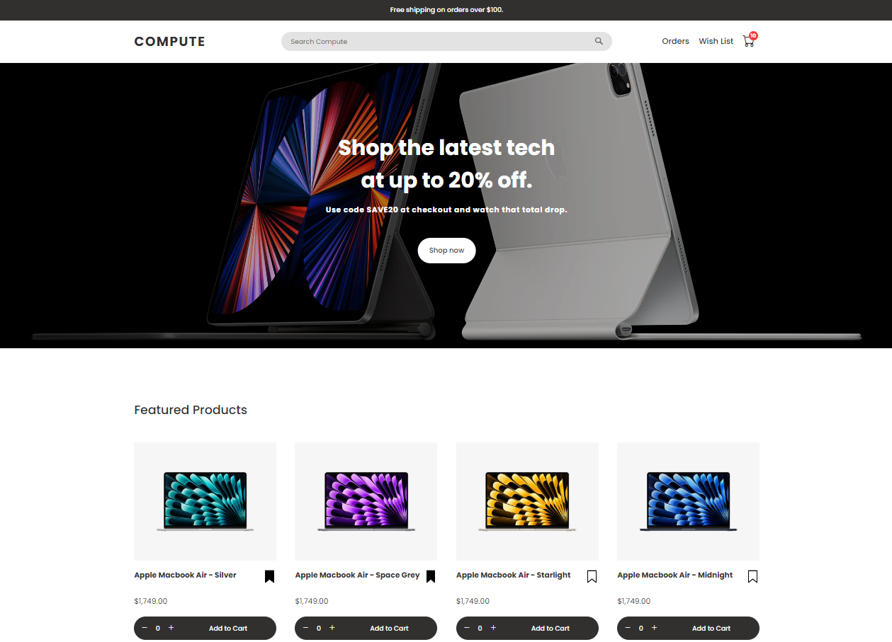
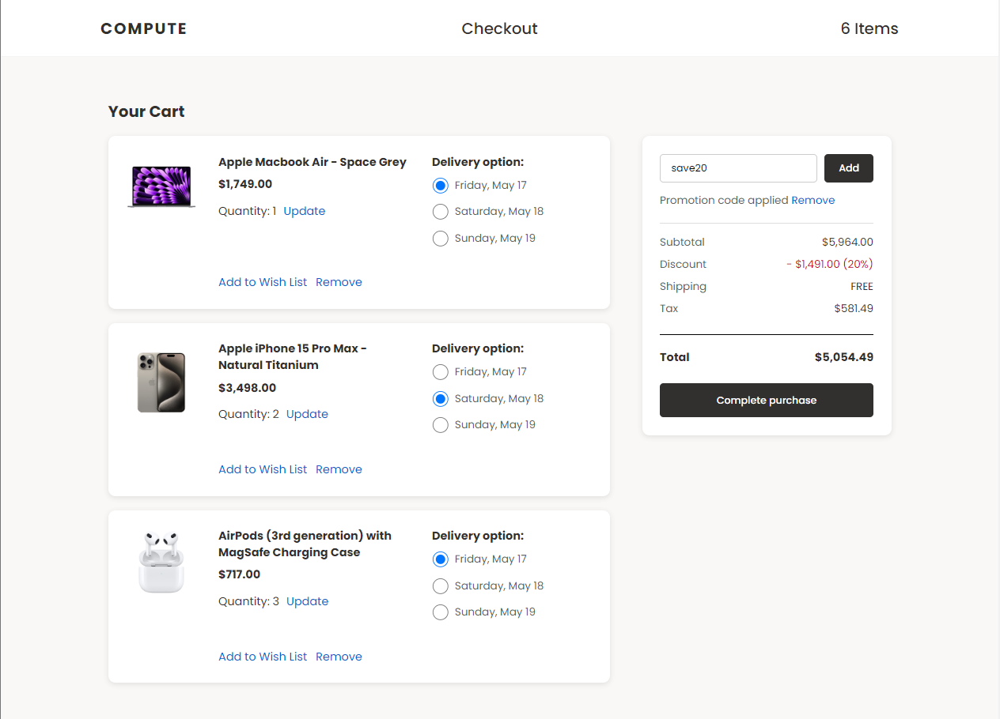
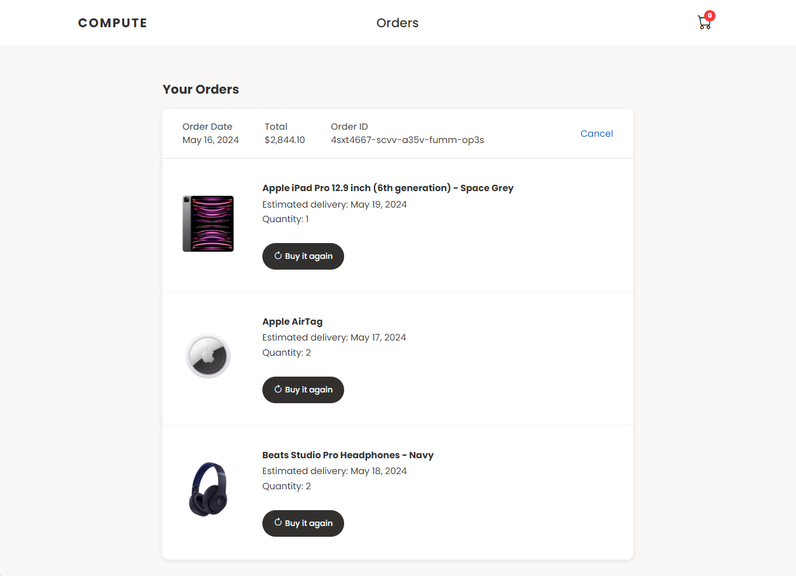

# Compute Store: E-commerce Web Application

## Overview
The Compute Store is an e-commerce web application for tech products. Key features include product search, cart and wishlist state management, automated discount handling, and order history tracking.

**[Visit the Compute Store](https://computestore.ca)**

## Preview

## Key Features
- **Product Search and Filtering**: Real-time product search and filtering functionality.
- **State Management**: Persistent wishlist and cart data consistency across sessions.
- **Checkout Engine**: Automated discount application, shipping eligibility calculations, and delivery scheduling.
- **Order Management**: Historical order tracking and management, including cancellation workflows.
- **Responsive Design**: UI consistency across multiple viewport breakpoints.
- **Automated Deployment**: CI/CD pipeline via GitHub Actions for automated deployment to Azure.

## Tech Stack
JavaScript, HTML, CSS, Microsoft Azure (Hosting), GitHub Actions (CI/CD)

## Author
Reshawn Lofters: [LinkedIn](https://linkedin.com/in/reshawnlofters)

## License
This project is licensed under a custom license. See the [LICENSE](./LICENSE) file for details.
