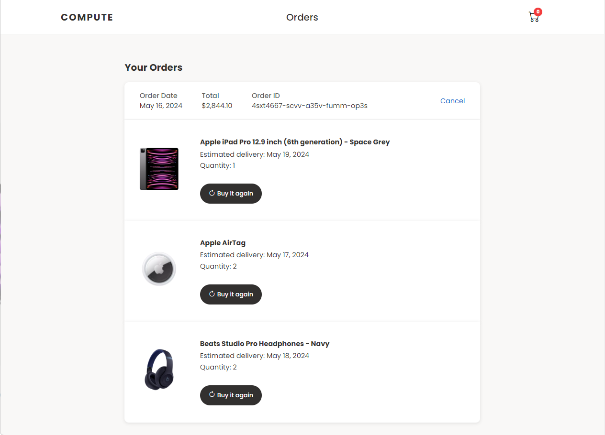

# Compute Store (E-commerce Store)

## Overview
The Compute Store offers an immersive shopping experience for the latest tech products. The application provides seamless product searching, browsing, wish list management, and cart features, allowing you to find and organize your desired products easily. It also offers a discount application feature for cost-saving opportunities, secure order placement, and order tracking through order history viewing.

Explore the Compute Store at [computestore.ca](https://computestore.ca).

### Preview

## Usage
- **Homepage**: Add products to your wish list and cart. Customize the number of items to add to your cart and use the search bar to navigate through products.
- **Wish List Page**: View your wish list items and the date they were added for transparency.
- **Checkout Page**: View your cart items, wish list items, and order summary. Customize cart item delivery dates and apply discounts for savings. Enjoy free shipping for qualifying orders.
- **Orders Page**: View detailed order information, including order date, total, and ID. Cancel orders.
- **Product Popup View**: Click on product images to enlarge them for enhanced product viewing.
- **Responsiveness**: Seamlessly use the Compute Store on any device with its responsive design.

## Technologies Used
- HTML, CSS, JavaScript, Git, GitHub Pages

## Author
The Compute Store is developed and maintained by Reshawn Lofters. For inquiries, suggestions, or feedback, please contact Reshawn Lofters at reshawnalofters@gmail.com.

## License
This project is licensed under the Compute Store License. See the [LICENSE](./LICENSE) file for details.